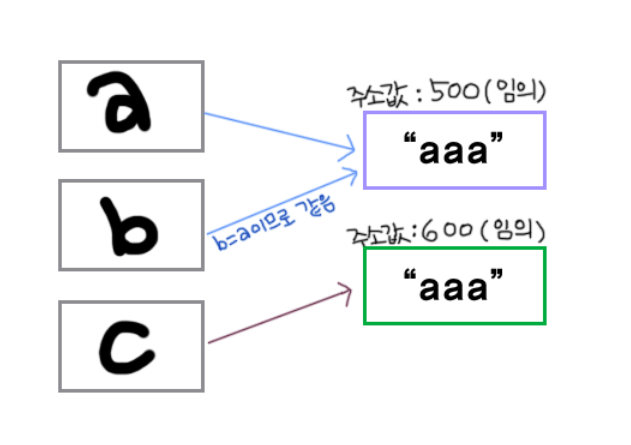

## Static
---
> .equals()는 참조 객체의 주소가 담고 있는 값을 비교하고, ==은 참조 객체의 주소를 비교한다

### example

```java
String a = "aaa";
String b = "aaa";
String c = new String("aaa");
```

위의 a, b, c는 모두 will을 담고 있지만 아래와 같은 차이를 보인다




따라서, 결과는 아래와 같다

```java
a.equals(b);            // true
a == b;                 // true
a == c;                 // false
a.equals(c);            // true
```
