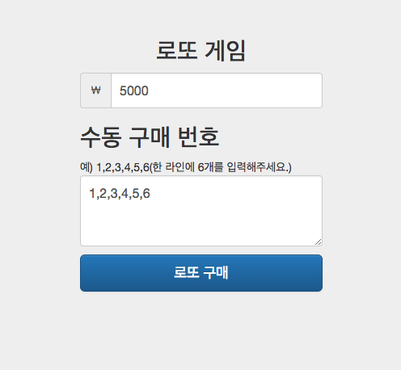
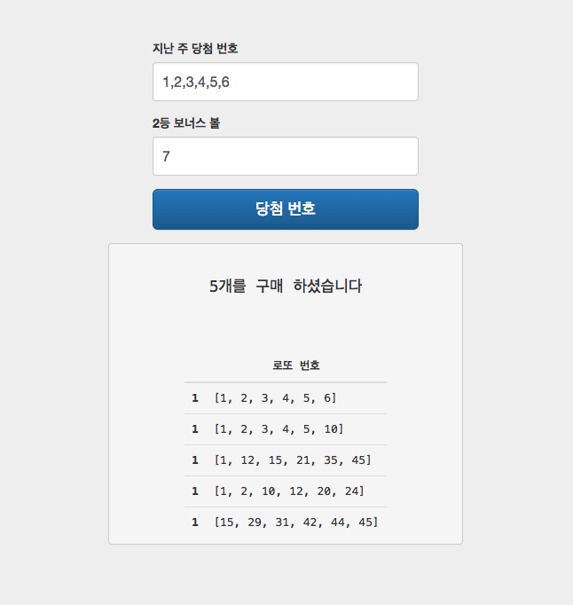
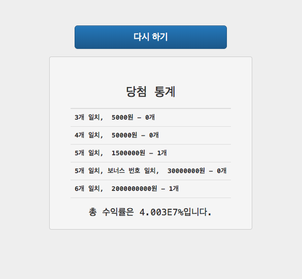

## lotto-step5
---

### requirement

web 연결해서 data 보내기

### output

### analysis

racingCar에서 localhost에 연결했을 때 보다 익숙해질 수 있었다. 이번 프로젝트를 통해 알게 된 것은 getter, setter 사용시 접근 제한자를 꼭 public으로 해야 한다는 것(java bean 규약). 또한 OS에 따라 개행 문자를 다르게 사용하는데, 이전의 프로젝트에서는 "\n"으로 모두 해결했지만, 이 작업에선 왜인지 "\r\n"을 꼭 사용했어야 했다. 이걸로 spark 끝
