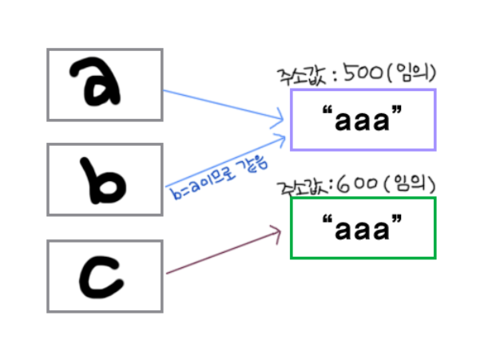

## .equals()와 ==의 차이
---
> .equals()는 참조 객체의 주소가 담고 있는 값을 비교하고, ==은 참조 객체의 주소를 비교한다

### example

```java
String a = "aaa";
String b = "aaa";
String c = new String("aaa");
```

위의 a, b, c는 모두 "aaa"을 담고 있지만 아래와 같은 차이를 보인다




따라서, 결과는 아래와 같다

```java
a.equals(b);            // true
a == b;                 // true
a == c;                 // false
a.equals(c);            // true
```

### 배열은 왜 이렇지?

-> String Class에서 equals를 재정의(@Override) 했기 때문, Object 참조

array1.equals(array2)는 array1 == array2와 같습니다. 무슨말이냐면 두 배열이 같은 객체인지를 비교하는 것입니다.

Arrays.equals(array1,array2)는 두 배열의 내용물들이 같은지를 비교합니다
