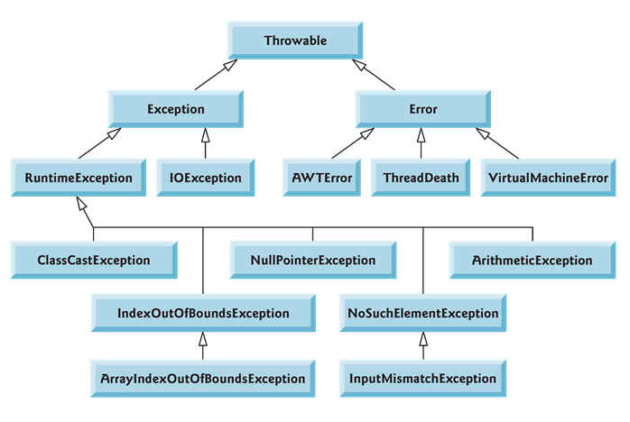

## 예외 처리
---

> exception ?
>
> 사용자의 잘못된 조작 또는 개발자의 잘못된 코딩으로 인해 발생하는 프로그램 오류
>
> error ?
>
> 하드웨어의 오동작 또는 고장으로 인해 애플리케이션이 정상적으로 동작하는데 발생하는 오류

### Hierarchy



### RuntimeException

* NullPointerException

객체 참조가 없는 상태에서 사용할 경우

* ArrayIndexOutOfBoundsException

배열에서 인덱스 범위를 초과하여 사용할 경우

* NumberFormatException

문자열을 숫자로 변환할 때, 숫자로 변활될 수 없는 문자가 포함되어 있는 경우

* ClassCastException

타입 변환이 불가능함에도 시도하는 경우

### 예외 처리 코드

일반 예외(Exception or checkedException)는 반드시 처리해야 하며, 실행 예외(RuntimeException or unCheckedException)는 optional

* try-catch-finally 블록

```java
try {

  예외 발생 가능 코드

} catch (예외 클래스 e) {

  예외 처리

} finally {

  항상 실행;

}
```

try 블록의 코드가 예외 발생 없이 정상 실행되면 catch 블록 넘어가고 finally 실행. 만약 예외가 발생하면 즉시 실행 멈추고 catch 블록으로 이동해 예외 처리 코드 실행. finally 블록은 항상 실행되지만 optional

```java
try {
  얘외 발생 코드
} catch (ArrayIndexOutOfBoundsException | NumberFormatException e) {
  예외 처리1
} catch (Exception e) {
  예외 처리2
}
```

catch 블록은 다중으로 만들 수 있다(if문 여러개 있을 수 있듯이). 하지만 상위 예외 클래스의 catch 블록이 가장 아래에 가도록 해야한다. 또한 '|'을 사용하여 multi catch 가능하다

### 예외 떠넘기기

```java
public void method1() {
  try {
    method2();
  } catch (ClassNotFoundException e) {
    System.out.println("클래스가 존재하지 않습니다");
  }
}

public void method2() throws ClassNotFoundException {
  Class clazz = Class.forName("java.lang.String2");
}
```

예외가 발생할 수 있는 메소드인 method2에서 직접 try-catch 블록을 사용하지 않고 throws를 통해 넘겼다

넘겨지는 메소드인 method2는 반드시 try 블록 내에서 호출되어야 한다

### 사용자 정의 예외 클래스 선언

API에 제공되지 않는 예외를 선언할 경우 사용한다

```java
public class MyException extends Exception {
  public MyException(String message) {
    super(message);
  }
}
```
일반 예외일 경우 Exception 상속, 실행 예외일 경우 RuntimeException 상속

위의 코드와 같이 생성자 선언을 포함한다. 예외 원인 메세지를 전달하기 위해 String 타입 매개변수 존재

* 예외 발생 시키기

```java
public void method() throws MyException {
  throw new MyException("메세지");
}
```

```java
try {
  method();
} catch (MyException e) {
  // 예외 처리
}
```

### 예외 정보 얻기

* getMessage()

예외를 발생시킬 때 String 타입의 메세제를 갖는 생성자를 이용하였다면, 메세지는 자동적으로 예외 객체 내부에 저장된다. 그렇기 때문에 catch 블록에서 getMessage()의 리턴값 확인 가능하다

* printStackTrace()

예외 발생 코드를 추적해서 모두 콘솔에 출력한다

```java
try {
  ...
} catch (MyException e) {
  // 예외가 가지고 있는 메세지 얻기
  String message = e.getMessage();

  // 예외의 발생 경로를 추적
  e.printStackTrace();
}
```
