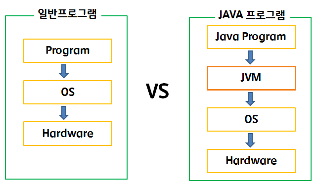
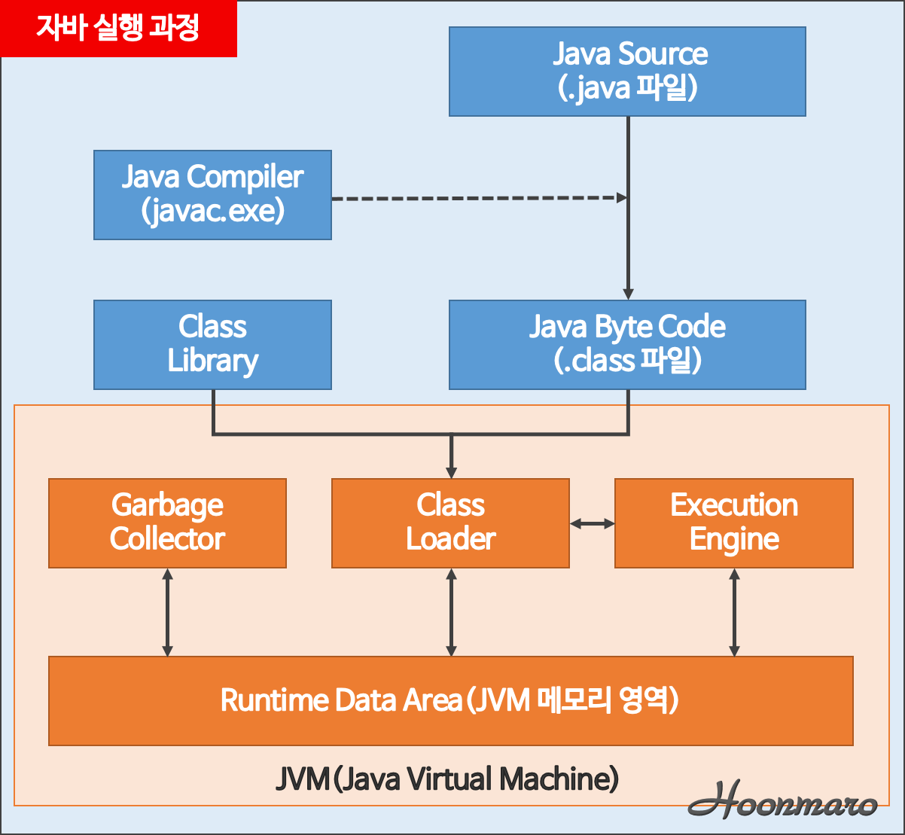
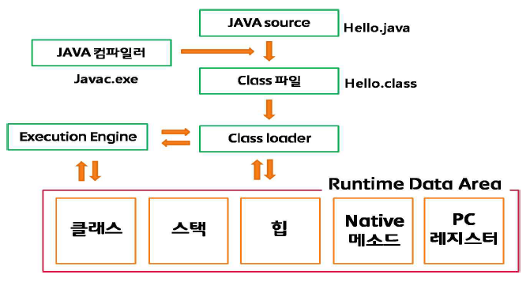
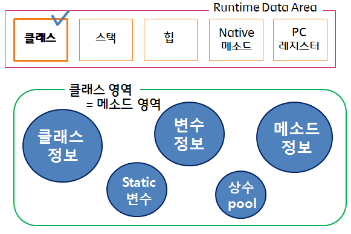
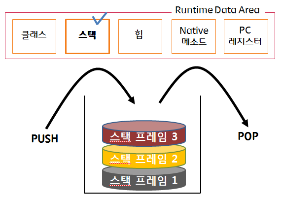
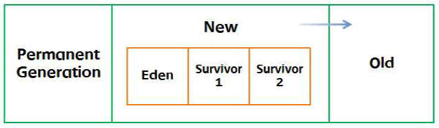

## JVM (Java Virtual Machine)
> 운영체제는 자바 프로그램을 바로 실행할 수 없는데, 그 이유는 자바 프로그램은 완전한 기계어가 아닌, 중간 단계의 바이트 코드이기 때문에 이것을 해석하고 실행할 수 있는 가상의 운영체제가 필요하다 -> JVM
>
> 따라서 운영체제에 무관하게 동일한 자바 프로그램을 개발할 수 있다(C와의 큰 차이, JAVA 이전에는 virtual machine아니다)
>
> 바이트 코드는 모든 JVM에서 동일한 실행 결과를 보장하지만, JVM은 운영체제에 종속적이다. 따라서 JAVA 프로그램을 운영체제가 이해하는 기계어로 번영해서 실행해야 하므로 JVM은 운영체제에 맞게 설치되어야 한다
>
> 자바의 가장 큰 장점 중의 하나인 "Write once, run anywhere" 특성을 보이지만, JVM에 의해 기계어로 번역되고 실행되기 때문에 C나 C++의 컴파일 단계에서 만들어지는 완전한 기계어보다는 속도가 느리다는 단점을 가지고 있다. 하지만 JVM 내부의 JIT 컴파일러를 통해 속도의 격차가 많이 줄어들고 있다

 

 

 

### JAVA 프로그램의 실행 구조

 

 

 

### 자바프로그램 실행 과정과 JVM메모리 구조

 

 

프로그램이 실행되면, JVM은 OS으로부터 이 프로그램이 필요로 하는 메모리를 할당받고, JVM은 이 메모리를 용도에 따라 여러 영역으로 나누어 관리한다

- JAVA Source : 사용자가 작성한 JAVA 코드
- JAVA Compiler　: JAVA 코드를 Byte Code로 변환시켜주는 기능
- Class Loader :　Class파일을 메모리(Runtime Data Area)에 적재하는 기능
- Execution Engine : Byte Code를 실행 가능하게 해석해주는 기능
- Runtime Data Area : 프로그램을 수행하기 위해 OS에서 할당 받은 메모리 공간
- Garbage Collector: JVM은 Garbage Collector를 통해 메모리 관리 기능을 자동으로 수행한다. 애플리케이션이 생성한 객체의 생존 여부를 판단하여 더 이상 사용되지 않는 객체를 해제하는 방식으로 메모리를 자동 관리한다.

 

 

### Runtime Data Area

 

***Class area***

 

Method Area, Code Area, Static Area 로 불리어짐

  i) Field Information : 멤버변수의 이름, 데이터 타입, 접근 제어자에 대한 정보

  ii) Method Information : 메서드의 이름, 리턴타입, 매개변수, 접근제어자에 대한 정보

  iii) Type Information : - Type의 속성이 Class인지 Interface인지의 여부 저장

- Type의 전체이름(패키지명+클래스명)

- Type의 Super Class의 전체이름 (단, Type이 Interface이거나 Object Class인 경우 제외)

- 접근 제어자 및 연관된 interface의 전체 리스트 저장

iv) 상수 풀(Constant Pool)

- Type에서 사용된 상수를 저장하는 곳(중복이 있을 시 기존의 상수 사용)

- 문자 상수, 타입, 필드, Method의 symbolic reference(객체 이름으로 참조하는 것)도 상수 풀에 저장

v) Class Variable

- Static 변수라고도 불림

- 모든 객체가 공유 할 수 있고, 객체 생성 없이 접근 가능

vi) Class 사용 이전에 메모리 할당

- final class 변수의 경우(상수로 치환되어) 상수 풀에 값 복사

 

 

***Stack area***

- Last In First Out (LIFO)
- 메서드 호출 시마다 각각의 스택프레임(그 메서드만을 위한 공간)이 생성
- 메서드 안에서 사용되어지는 값들 저장, 호출된 메서드의 매개변수, 지역변수, 리턴 값 및 연산 시 일어나는 값들을 임시로 저장
- 메서드 수행이 끝나면 프레임별로 삭제

 

 

***Heap area***

new 연산자로 생성된 객체와 배열을 저장하는 공간

클래스 영역에 로드된 클래스만 생성가능

Garbage Collector를 통해 메모리 반환

 

i) Permanent Generation
- 생성된 객체들의 정보의 주소 값이 저장된 공간

ii) New Area
- Eden : 객체들이 최초로 생성되는 공간
- Survivor : Eden에서 참조되는 객체들이 저장되는 공간

iii) Old Area : New Area에서 일정시간이상 참조되고 있는 객체들이 저장되는 공간

 

 

***Native method stack area***

- 자바 외의 다른 언어에서 제공되는 메서드들이 저장되는 공간

 

 

***PC Register***

- Thread가 생성 될 때마다 생성되는 공간
- Thread가 어떤 부분을 어떤 명령으로 실행할 지에 대한 기록
- 현재 실행되는 부분의 명령과 주소를 저장

 

 

### Garbage Collection

 

- 참조되지 않은 객체들을 탐색 후 삭제

- 삭제된 객체의 메모리를 반환

- Heap 메모리의 재사용

 

 

***Minor Garbage Collection***

i) New 영역에서 일어나는 Garbage Collection

ii) Eden영역에 객체가 가득 차게 되면 첫 번째 Garbage Collection 발생

iii) Survivor1 영역에 값 복사

iv) Survivor1 영역을 제외한 나머지 영역의 객체들을 삭제

v) Eden영역과 Survivor1영역의 메모리가 기준치 이상일 경우, Eden 영역에 생성된 객체와 Survivor1영역에 있는 객체 중 참조되고 있는 객체가 있는지 검사

vi) 참조되고 있는 객체를 Survivor2 영역에 복사

vii) Surviver2 영역을 제외한 영역의 객체들을 삭제

viii) 일정시간이상 참조되고 있는 객체들을 Old영역으로 이동

ix) 반복

 

 

***Major Garbage Collection (Full Garbage Collection)***

i) Old영역에 있는 모든 객체들을 검사

ii) 참조되지 않은 객체들을 한꺼번에 삭제

iii) Minor Garbage Collection에 비해 시간이 오래 걸리고 실행 중 프로세스가 정지

 

 

참조

http://hoonmaro.tistory.com/19

http://huelet.tistory.com/entry/JVM-%EB%A9%94%EB%AA%A8%EB%A6%AC%EA%B5%AC%EC%A1%B0
