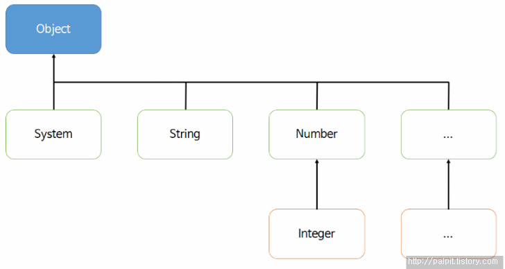

## Object
---

>  java의 최상위 부모 클래스



### 객체 비교, equals()

Object class의 equals() 메소드는 비교 연산자인 ==과 동일한 결과를 리턴한다. 하지만 각 객체에서 equals() 메소드를 @Override하여 equals의 의미를 다르게 나타내기도 한다. 예를 들어, String class에서 equals()는 기준 객체와 비교 객체의 번지 값을 비교하는 것이 아니라 문자열을 비교한다. 또한 기준 객체와 비교 객체의 타입은 동일해야한다. 그렇지 않으면 false를 return한다

```java
@Override
public boolean equals(Member m2) {
  if (m2 instanceof Member) {
    if (id.equals(m2.id)) {
      System.out.println("true");
    }
  }
  return false;
}
```

### 객체 해시코드, hashCode()

두 객체가 같은지 식별한다. Object의 hachCode() 메소드는 객체의 메모리 번지를 이용해서 해시코드를 만들어 정수값을 리턴한다. 객체 비교는 아래의 flow chart 흐름을 따른다. hashCode() 역시 해당 클래스에서 @override를 통해 다르게 정의한다. hashCode()와 equals()는 함께 재정의되어 두 객체의 동등 비교를 할 수 있다


```Java
@override
public int hashCode() {
  return id.hashCode();
}
```

hashCode()와 equals()의 관계

* equals 는 두 객체의 내용이 같은지, 동등성(equality) 를 비교하는 연산자
* hashCode 는 두 객체가 같은 객체인지, 동일성(identity) 를 비교하는 연산자


### 객체 문자 정보, toString()

객체의 문자 정보를 리턴한다. toString() 메소드를 @Override하여 좀 더 유용한 정보를 얻을 수 있다. 만약 매개값으로 객체를 주면 객체의 toString() 메소드를 호출해서 리턴값을 받아 출력하도록 되어 있다

SmartPhone.java
```Java
public class SmartPhone() {
  private String company;
  private String os;

  public SmartPhone(String company, String os) {
    this.company = company;
    this.os = os;
  }

  @overridepublic String toString() {
    return company + ", " + os;
  }
}
```

SmartPhoneExample.java
```Java
public class SmartPhoneExample() {
  public static void main(String[] args) {
    SmartPhone myPhone = new SmartPhone("구글", "안드로이드");

    String str = myPhone.toString();
    System.out.println(str);
    System.out.println(myPhone);
  }
}
```

출력 결과

구글, 안드로이드

구글, 안드로이드
